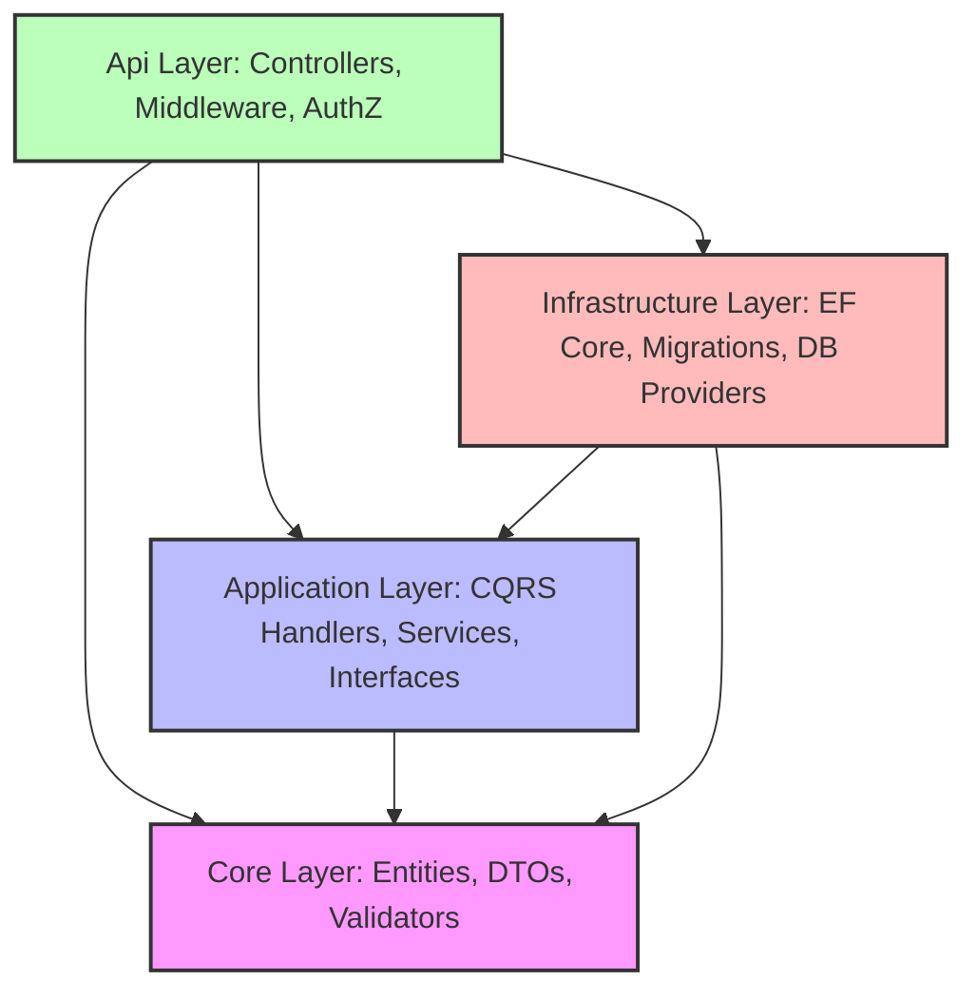

# Codebase Architecture and Optimization Summary

This document provides a comprehensive architectural breakdown of the **MinimumBackend** codebase, followed by a prioritized roadmap of optimization ideas to improve the structure, performance, and developer experience.

---

## 1. Architectural Blueprint & Layer Breakdown

The project follows the principles of **Clean Architecture** (and some DDD concepts), aiming to keep the domain core isolated from external frameworks, infrastructure, and delivery mechanisms.



### 📂 Directory & Project Analysis

#### 🟢 Core (Domain Layer)
*   **Role**: Contains the enterprise and application domain business objects, DTOs, and validation logic. It holds zero external dependencies (aside from helper libraries like FluentValidation).
*   **Key Components**:
    *   `Entities/`: `User`, `Role`, `Permission`, `RefreshToken` inheriting from `BaseEntity`. These define the schema and domain rules.
    *   `DTOs/`: Data transfer contracts for authentication and user actions (e.g., `UserRegisterDto`, `UserLoginDto`, `TokenResponseDto`).
    *   `Validators/`: Strong validation rules written using **FluentValidation** (e.g., `UserRegisterDtoValidator` enforcing password policies, formats).

#### 🔵 Application (Orchestration Layer)
*   **Role**: Orchestrates business logic, defining the workflows, commands, and queries.
*   **Key Components**:
    *   `Command/` & `Handler/`: Implementation of the **CQRS (Command Query Responsibility Segregation)** pattern using **MediatR**.
    *   `Services/`: Concrete services such as `AuthService` and `EmailService`.
    *   `Interfaces/`: Core contracts defining services (like `IEmailService`, `IAuthService`) and CQRS helpers (`ICommand`, `IQuery`).
    *   `Mapping/`: AutoMapper profiles (`MappingProfile`) that handle translation between domain Entities and DTOs.

#### 🔴 Infrastructure (Data/Persistence Layer)
*   **Role**: Direct interaction with database engines, external systems, and file persistence.
*   **Key Components**:
    *   `Data/`: `AppDbContext` configuring DB sets and overriding `SaveChangesAsync` to automatically populate audit fields (`CreatedAt`, `UpdatedAt`). Also includes `DBInitializer` for seeding seed roles and users.
    *   `DBSets/`: Entity Framework Core entity configurations (Fluent API) defining keys, index constraints, and relationships.
    *   `Provider/`: `PermissionProvider` for role-based/permission-based authorization lookups.
    *   `Migrations/`: SQL schema migration files targeting SQLite database engines.

#### 🟡 Api (Presentation/Entry Point Layer)
*   **Role**: Exposes RESTful HTTP endpoints, acts as the app composition root (`Program.cs`), and handles cross-cutting concerns (middleware, rate-limiting, and auth filters).
*   **Key Components**:
    *   `Controllers/`: Base controllers and feature-specific controllers (e.g., `AuthController`, `RBACTestController`).
    *   `Middleware/`: Custom pipeline behaviors including `LoggingMiddleware` and `ExceptionMiddleware` (translates exceptions to unified error DTOs).
    *   `Handler/` & `Provider/`: Declarative permission-based authorization policies (`PermissionHandler`, `PermissionRequirement`, `HasPermissionAttribute`, and a custom dynamic `PermissionPolicyProvider`).
    *   `Program.cs`: Entry point configuring services (Serilog, Swagger, Scalar UI, JWT Auth, CORS, Health Checks, and Rate Limiting).

#### 👾 MinimumBackend.AppHost (.NET Aspire Orchestrator)
*   An empty orchestrator skeleton that runs the Aspire host but is not yet configured to wire up target resources.

---

## 2. Key Architectural Decisions & Patterns

1.  **CQRS with MediatR**: Exposes endpoints via command/query contracts, allowing easy expansion, auditability, and side-effect segregation.
2.  **Role-Based Access Control (RBAC)**: Fine-grained, custom, permission-based authorization utilizing a declarative `[HasPermission(typeof(PermissionName))]` attribute.
3.  **Auditable Base Entity**: Automatic population of audit timestamps on database writes, reducing boilerplate across entities.
4.  **Scalar API Reference**: Configured in `Program.cs` alongside standard Swagger for high-fidelity API documentation.

---

## 3. Optimization Roadmap & Ideas

Here is a categorized list of optimizations that can be carried out to enhance code quality, performance, and maintainability.

### 🚀 Optimization Group A: Architectural & SOLID Improvements

#### 1. Resolve Dependency Inversion Principle (DIP) Violation
*   **Problem**: In `Application/Services/AuthService.cs`, the service directly references the concrete `AppDbContext` (an Infrastructure concerns). In Clean Architecture, the Application layer must only depend on abstractions (interfaces).
*   **Solution**:
    *   Create an interface in the Application layer (e.g., `IAppDbContext` exposing `DbSet<User>`, `DbSet<RefreshToken>`, etc.), and make the concrete `AppDbContext` implement it.
    *   Alternatively, introduce Repository interfaces (e.g., `IUserRepository`, `IRefreshTokenRepository`) in the Application/Core layers and implement them in the Infrastructure layer.

#### 2. Eliminate CQRS Dual-Dispatch / Boilerplate Duplication
*   **Problem**: Currently, MediatR handlers (such as `LoginCommandHandler`) are just redundant wrappers that delegate all business logic to `IAuthService`. This introduces a double-abstraction layer (Controller ➡️ MediatR Command ➡️ Handler ➡️ AuthService ➡️ DB).
*   **Solution**:
    *   **Option A (Pure CQRS)**: Move the business logic directly from `AuthService` into the corresponding MediatR handlers. Delete `IAuthService` and `AuthService` to drastically reduce boilerplate.
    *   **Option B (Direct Service)**: If MediatR CQRS is deemed unnecessary overhead for basic CRUD, remove MediatR commands and have controllers directly inject and call `IAuthService`.

---

### ⚡ Optimization Group B: Performance & DB Upgrades

#### 3. SQLite Database Optimizations (WAL Mode)
*   **Problem**: SQLite can block concurrent reads/writes if not configured correctly under high load.
*   **Solution**:
    *   Enable **Write-Ahead Logging (WAL)** mode. Update the connection string in `appsettings.json` to include:
        `"DefaultConnection": "Data Source=store.db;Cache=Shared;Mode=ReadWriteCreate;Journal Mode=WAL;"`
    *   Set SQL command timeouts and synchronous mode parameters.

#### 4. Automated Database Migration & Seeding during Development
*   **Problem**: Developers must manually execute CLI commands (`dotnet ef database update`) to set up their databases, and the database seeding block in `Program.cs` is currently commented out.
*   **Solution**:
    *   Uncomment and refactor the startup initialization block in `Program.cs` inside an `if (app.Environment.IsDevelopment())` block.
    *   Run `await dbContext.Database.MigrateAsync(cancellationToken)` on startup to automatically apply pending migrations.

#### 5. Implement a Global MediatR Validation Pipeline Behavior
*   **Problem**: FluentValidation validators are registered but need to be manually validated inside controllers/handlers, or rely on MVC validation.
*   **Solution**:
    *   Create a MediatR pipeline behavior: `ValidationBehavior<TRequest, TResponse> : IPipelineBehavior<TRequest, TResponse>`.
    *   This interceptor runs all registered `IValidator<TRequest>` instances automatically when a command is dispatched.
    *   If invalid, it throws a `ValidationException` which the `ExceptionMiddleware` catches and translates into a standard `400 Bad Request` payload. This keeps handlers and controllers completely free of validation checks.

---

### 🛠️ Optimization Group C: DX (Developer Experience) & Modern .NET

#### 6. Enable Global Usings
*   **Problem**: Source files contain redundant repeating block lists of namespace imports (e.g., `using System;`, `using Microsoft.EntityFrameworkCore;`).
*   **Solution**:
    *   Create a `GlobalUsings.cs` file in each project root.
    *   Declare common namespaces globally:
        ```csharp
        global using System;
        global using System.Threading;
        global using System.Threading.Tasks;
        global using Microsoft.EntityFrameworkCore;
        ```

#### 7. Populate .NET Aspire AppHost
*   **Problem**: The AppHost project is empty and does not orchestrate any services.
*   **Solution**:
    *   Add the `Api` project as a resource in `AppHost.cs`:
        ```csharp
        var builder = DistributedApplication.CreateBuilder(args);
        var api = builder.AddProject<Projects.Api>("api");
        builder.Build().Run();
        ```
    *   Configure SQLite DB or potential Redis containers in Aspire for local orchestration.

---

## 4. Prioritized Optimization Checklist

- [ ] **Phase 1: DX & Architecture Foundations**
  - [ ] Implement `GlobalUsings.cs` across all 4 main projects.
  - [ ] Un-comment / implement automated DB migration and seeding in `Program.cs` for development.
- [ ] **Phase 2: Redundancy Cleanup & DIP Guardrails**
  - [ ] Abstract concrete context in Application layer via an `IAppDbContext` interface.
  - [ ] Consolidate/migrate business logic from `AuthService` into CQRS Handlers (pure CQRS approach) to eliminate redundant layers.
- [ ] **Phase 3: Pipeline Interceptors & Security**
  - [ ] Build a generic MediatR `ValidationBehavior` to automate FluentValidation triggers.
- [ ] **Phase 4: Orchestration & Performance**
  - [ ] Populate .NET Aspire AppHost to orchestrate the Api project.
  - [ ] Configure WAL mode on SQLite connection strings for high-concurrency capability.
